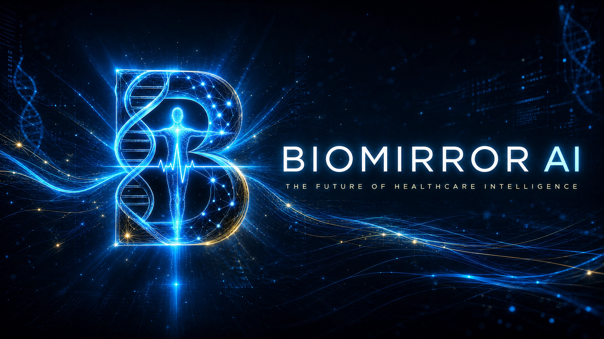
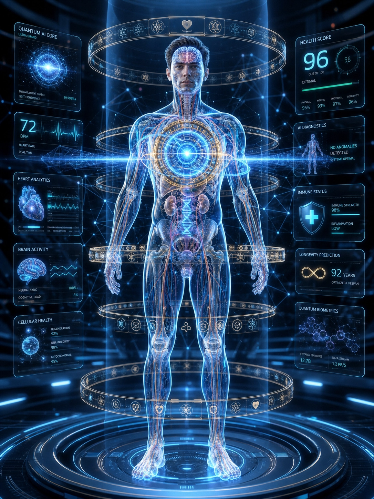
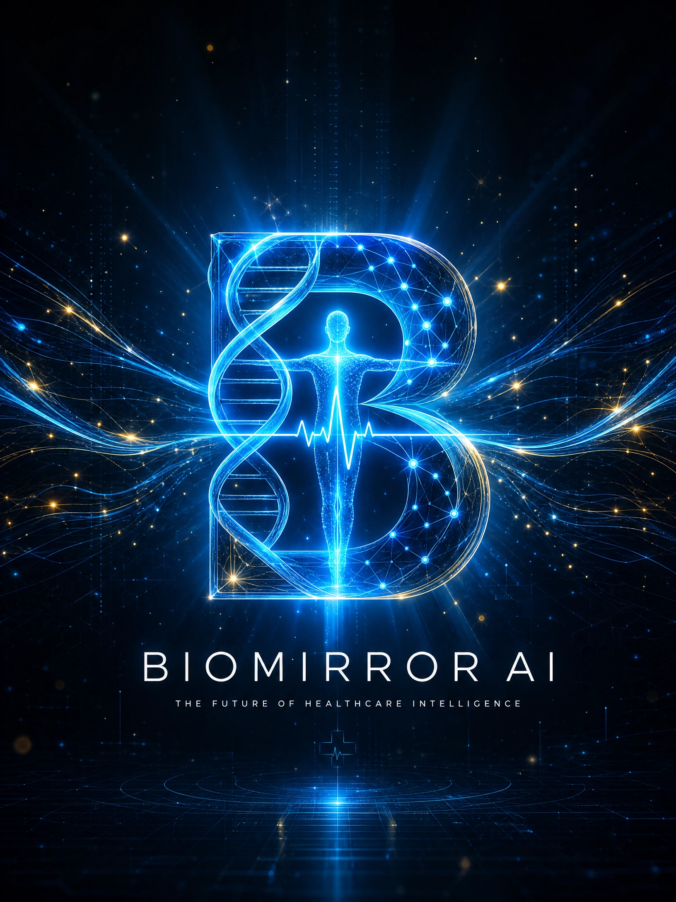
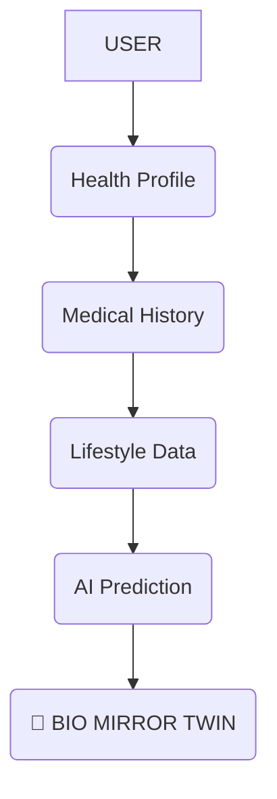
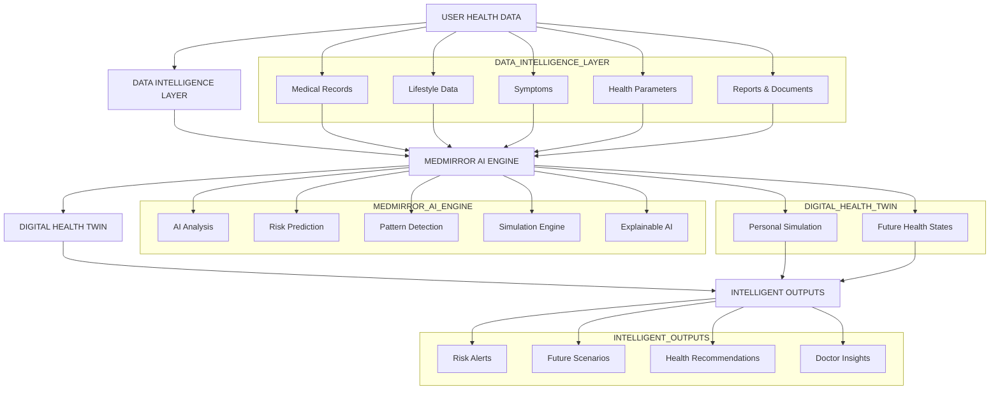
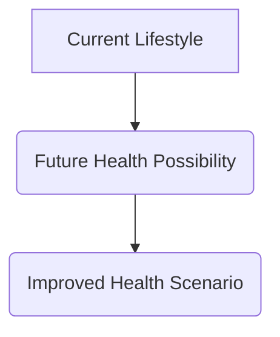
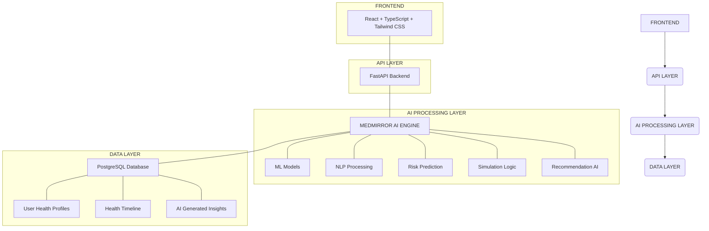
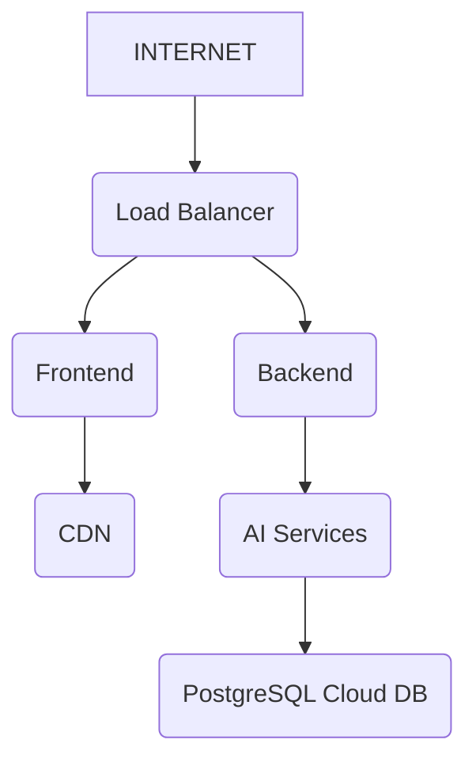

# 🧬 BioMirror AI: The Personal AI Health Simulation Twin

  
    
  <h1>**"See your health today. Understand your risks tomorrow. Simulate a healthier future."**</h1>
  <h3>AI + Digital Twin + Predictive Healthcare Platform</h3>
   
   &nbsp;&nbsp;&nbsp;
   &nbsp;&nbsp;&nbsp;
  
    
  <h3>Artificial Intelligence • Digital Twin Technology • Preventive Healthcare • Explainable AI</h3>
   
  <h2>🚀 Rush Hour 2026 Hackathon</h2>
  <h2>🏆 Team VITALSYNC</h2>

---

## 🌌 Product Identity: A New Era of Preventive Healthcare Intelligence

BioMirror AI introduces a revolutionary approach to healthcare by creating a personalized **AI-powered Digital Health Twin** that understands, predicts, and simulates an individual's health journey. Unlike conventional healthcare platforms that react after symptoms appear, BioMirror AI shifts the paradigm from reactive treatment to proactive prevention.

  
   
  <h2>"Your Body. Your Data. Your Digital Future."</h2>

### The Current Healthcare Reality

Modern healthcare has achieved incredible breakthroughs, yet the system primarily operates in a reactive mode. Individuals typically seek medical attention after symptoms appear, after risks become serious, or after prevention opportunities are missed. The prevailing question is often, "How do we treat the disease?" rather than, "How do we prevent the disease from happening?"

| ⚠️ Challenge | Impact |
|---|---|
| Reactive Healthcare | Problems detected late |
| Fragmented Data | Health patterns remain hidden |
| Generic Advice | Personal differences ignored |
| Limited Prediction | Future risks unknown |

### The Global Healthcare Challenge

Human health is dynamic, changing daily through biological factors, lifestyle choices, nutrition patterns, sleep quality, mental well-being, and medical history. Current healthcare systems often capture only snapshots, missing the complete health journey. BioMirror AI exists to provide this missing intelligence layer.

---

## 🧬 Why BioMirror AI Must Exist

The human body is a continuously changing biological system, not a machine that breaks suddenly. Small changes in sleep, activity, nutrition, stress, or health indicators can significantly influence future wellness. The core problem is not a lack of data, but a lack of understanding. BioMirror AI provides this crucial understanding.

  <h1>"Your body is already telling a story. BioMirror AI helps you understand it before it becomes a problem."</h1>

### Healthcare Before vs. BioMirror AI Future

| Traditional Healthcare | BioMirror AI Future |
|---|---|
| Reactive treatment | Predictive prevention |
| Disease focused | Wellness focused |
| Hospital visits after symptoms | Continuous health intelligence |
| Fragmented health records | Unified personal health twin |
| Generic recommendations | Personalized simulations |
| Limited future visibility | Scenario prediction |
| Treat problems | Prevent possibilities |

**From Reactive Healthcare:**
Symptom → Doctor Visit → Diagnosis → Treatment

**To Predictive Healthcare:**
Health Data → AI Understanding → Digital Twin Simulation → Risk Prediction → Preventive Action

---

## 🌱 The Future We Imagine

Imagine a world where:

✨ People understand their future health risks
✨ Doctors receive deeper patient intelligence
✨ Prevention becomes personalized
✨ Healthcare moves from reaction to anticipation

BioMirror AI represents a fundamental shift: from treating illness to understanding life.

---

## 🧠 Meet BioMirror AI: The Solution Universe

  

<h2 align="center">
  "The Future of Healthcare is Not Reactive. It is Predictive, Personalized, and Simulated."
</h2>

BioMirror AI creates a living digital representation of an individual's health, allowing people to understand their current condition, predict future risks, and simulate healthier decisions before diseases appear.

### A New Paradigm

Traditional healthcare: Disease Appears → Symptoms Detected → Doctor Consultation → Treatment Begins. By the time symptoms appear, the human body may have already experienced years of hidden changes.

BioMirror AI introduces a new paradigm:
Human Data → AI Health Understanding → Personal Digital Twin → Future Health Simulation → Preventive Action

Healthcare moves from:

| Existing Healthcare | BioMirror AI |
|---|---|
| Reactive | Predictive |
| Disease-focused | Wellness-focused |
| Population-based | Individual-based |
| Treat after detection | Prevent before progression |
| Static reports | Living health intelligence |

---

## 🧬 The BioMirror Digital Twin

### Your Health. Your Future. Your Simulation.

A Digital Twin is a virtual representation of a real-world system. BioMirror AI creates a personalized health twin by combining:

The Digital Twin continuously learns:

- Biological patterns
- Lifestyle behavior
- Health trends
- Risk indicators
- Preventive opportunities

It becomes a mirror of your health journey.

---

## 🧠 Inside BioMirror AI: The MEDMIRROR AI ENGINE

### The AI Brain That Understands Your Future Health

BioMirror AI is not just a health tracking application; it is an intelligent healthcare simulation system powered by a multi-layer AI architecture that transforms raw health information into a continuously evolving personal health intelligence model. At its core is the:

# **MEDMIRROR AI ENGINE™**

**Medical Evolution Digital Mirror Intelligence Engine**

A personalized AI reasoning system that learns, predicts, simulates, and explains possible health outcomes using Digital Twin technology.

---

## ⚡ BioMirror AI Architecture Overview

MEDMIRROR AI acts as the central nervous system of BioMirror AI, continuously processing multiple health dimensions and building a dynamic understanding of an individual's health trajectory. Unlike traditional healthcare applications that only store information, BioMirror AI learns, reasons, predicts, and simulates.

---

## 🔥 MEDMIRROR AI Core Modules

### 1. Health Data Intelligence Module: "Understanding the Present"

The system collects and processes personal health profiles, lifestyle patterns, medical history, symptoms, reports, and daily wellness inputs. The AI converts fragmented health information into structured intelligence.

### 2. Pattern Recognition Engine: "Finding Hidden Signals"

Healthcare problems often develop silently. MEDMIRROR AI identifies long-term health trends, behavior patterns, lifestyle risks, and early warning signals using AI-driven pattern analysis.

### 3. Predictive Health Intelligence: "Understanding Tomorrow"

The prediction engine estimates possible future health conditions by analyzing current health status, historical patterns, risk factors, and lifestyle behavior. The goal is to move healthcare from Reactive Treatment to Predictive Prevention.

### 4. Digital Twin Simulation Engine: "Testing Possible Futures"

The Digital Twin creates a computational representation of the user's health state. Users can simulate "what if?" scenarios, such as the impact of improved sleep or decreased activity, to visualize future health possibilities.

### 5. Explainable AI Layer (XAI): "AI That Humans Can Trust"

Healthcare decisions require transparency. BioMirror AI explains why a risk was detected, which factors influenced the prediction, and what actions may improve the outcome. For example, it can explain an increased cardiovascular risk due to reduced activity, irregular sleep, and previous health indicators, recommending increased physical activity.

### 6. Personalized Health Recommendation Engine

Every human is different. MEDMIRROR AI creates personalized guidance instead of generic advice. It tailors recommendations based on age, lifestyle, and health history.

### 7. AI Health Score System

MEDMIRROR AI generates a dynamic wellness intelligence score (e.g., 87%) based on sleep, nutrition, activity, stress, and medical risk. This score evolves with the user's health journey.

---

## 🏗️ Technical Architecture

### BioMirror AI Platform

  

### AI Model Stack

*   **Machine Learning:** Used for risk prediction, pattern detection, and classification. Technologies: Python, Scikit-Learn, Pandas, NumPy.
*   **Natural Language Intelligence:** Used for medical report understanding, AI explanations, and health conversations. Technologies: LLM Integration, Prompt Engineering, Medical Knowledge Retrieval.
*   **Computer Vision Intelligence:** Used for medical document extraction and report understanding. Technologies: OCR, Document AI, Image Processing.

---

## 🔄 BioMirror AI Workflow

User provides health information → AI cleans and structures the data → MEDMIRROR AI analyzes patterns → Prediction models identify possible risks → Digital Twin simulates future possibilities → AI generates personalized recommendations → User understands and improves future health.

---

## 🌎 Why BioMirror AI Is Different

| Traditional Healthcare Apps | BioMirror AI |
|---|---|
| Stores health records | Creates health intelligence |
| Tracks current status | Predicts future possibilities |
| Reactive approach | Preventive approach |
| Generic suggestions | Personalized simulations |
| Data collection | AI reasoning |
| No future visualization | Digital Twin technology |

---

## 🔐 Privacy-First AI Architecture

BioMirror AI follows a privacy-centered healthcare design with core principles:

✅ User-controlled health data
✅ Consent-based sharing
✅ Secure authentication
✅ Transparent AI explanations
✅ Doctor-controlled collaboration

The future of healthcare must not only be intelligent; it must be trustworthy.

### Doctor Collaboration Security

BioMirror AI provides controlled healthcare sharing. The patient always controls what data is shared, who accesses it, and how long access remains active.

Patient → Generate Temporary Access → Secure QR / Link → Doctor Portal → Limited Health View

---

## ☁️ Deployment Architecture

BioMirror AI is designed for cloud-native deployment.

### Deployment Stack

| Component | Technology |
|---|---|
| Frontend Hosting | Vercel / Netlify |
| Backend Hosting | Render / AWS / Azure |
| Database | PostgreSQL Cloud |
| Containerization | Docker |
| API Testing | Postman |
| Version Control | GitHub |

### Container Architecture

Future production deployment will utilize a Docker Environment with separate containers for Frontend, FastAPI, AI Engine, and PostgreSQL.

---

## 📈 Scalability Blueprint

BioMirror AI is designed to evolve, with future expansion plans from MVP to AI Health Assistant, Multi-Disease Prediction, Hospital Integration, and ultimately a Global Preventive Healthcare Platform.

---

## 🏆 Engineering Philosophy

BioMirror AI is built on five principles:

1.  **Intelligence First:** AI should understand health data, not just store it.
2.  **Privacy First:** Healthcare data belongs to the individual.
3.  **Explainability First:** Every prediction should have reasoning.
4.  **Scalability First:** Architecture should support millions of users.
5.  **Human First:** Technology should empower doctors and patients.

---

## 🌎 From Application To Healthcare Intelligence Platform

BioMirror AI is engineered as: "A continuously learning personal healthcare intelligence system that allows humans to understand, simulate, and improve their future health."

### BioMirror AI Engineering Summary

*   **Frontend:** React + TypeScript + Tailwind + Three.js
*   **Backend:** FastAPI + Python
*   **Database:** PostgreSQL
*   **AI:** MEDMIRROR AI Engine
*   **Security:** JWT + Encryption + Consent Control
*   **Deployment:** Docker + Cloud Infrastructure

This is not a health dashboard. This is an intelligent healthcare simulation system powered by AI + Digital Twin technology.

---

## 🧬 BioMirror AI User Journey

"A healthcare experience where every individual gets a personal AI-powered health twin that understands the present, predicts the future, and helps create a healthier tomorrow."

BioMirror AI is an **intelligent health companion ecosystem** where users move from passive healthcare consumers to active health decision-makers.

The complete journey transforms:

❌ Waiting for disease symptoms
⬇️
✅ Predicting health risks before they appear

❌ Generic healthcare advice
⬇️
✅ Personalized AI-driven recommendations

---

## 🤝 Team VITALSYNC

Thank you for considering BioMirror AI. We believe this project represents a significant leap forward in preventive healthcare, leveraging cutting-edge AI and Digital Twin technology to empower individuals and revolutionize health management. We are confident that BioMirror AI has the potential to make a profound impact on global health outcomes.

---

## 🔗 Links

*   [GitHub Repository]()
*   [Project Demo Video](YOUR_DEMO_VIDEO_LINK_HERE)
*   [Presentation Slides](YOUR_PRESENTATION_SLIDES_LINK_HERE)

---

**Sathyabama Hackathon — Submission Edition**

